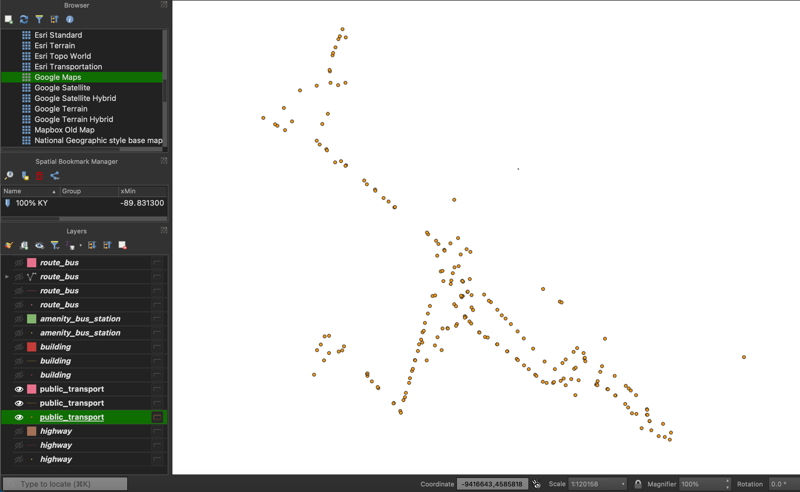
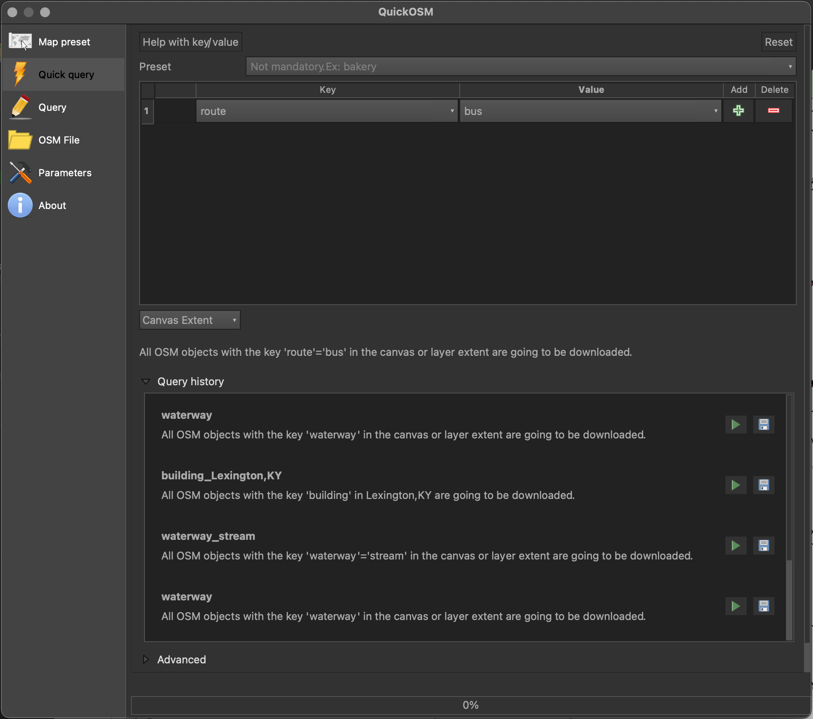
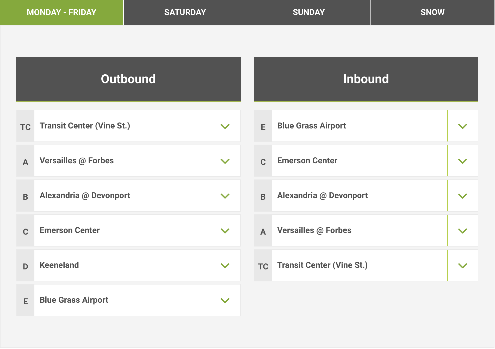
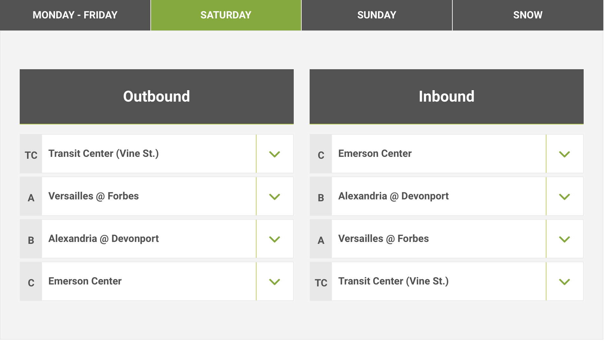
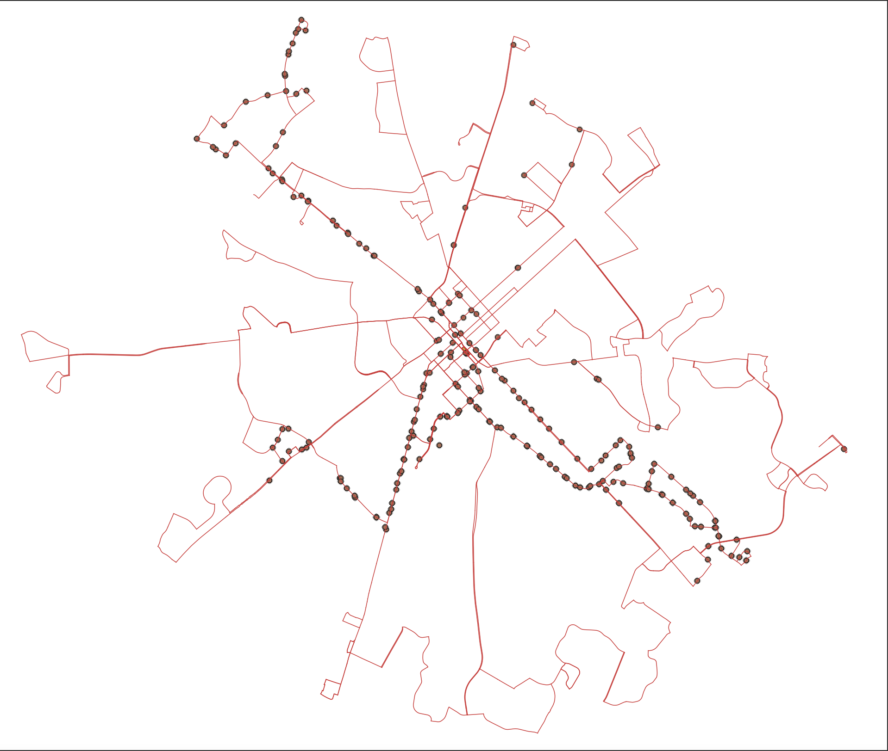
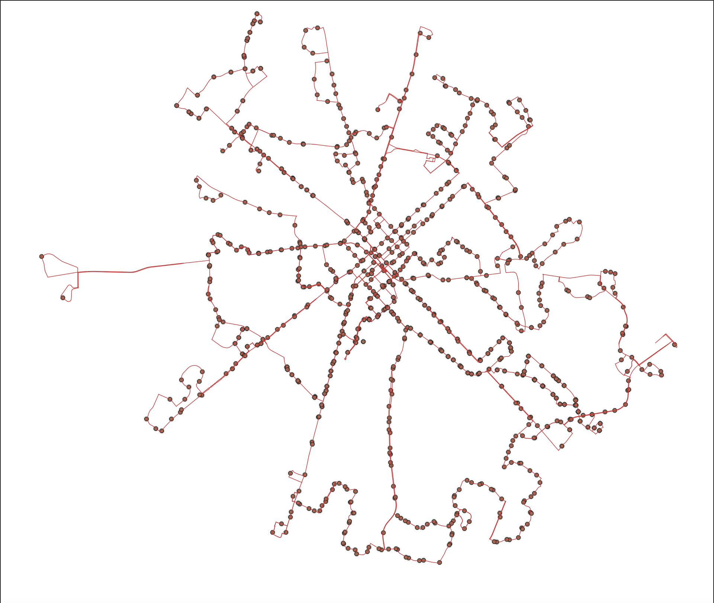
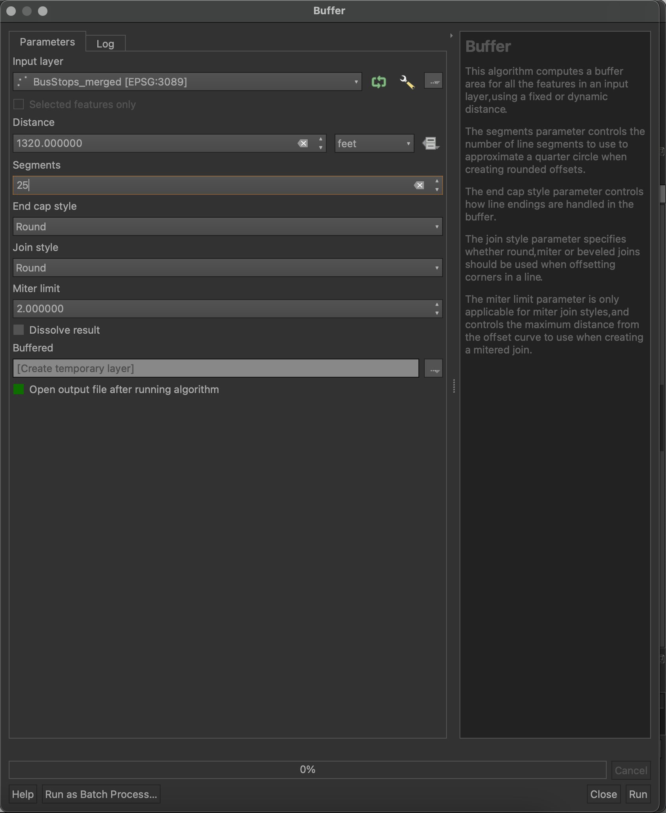
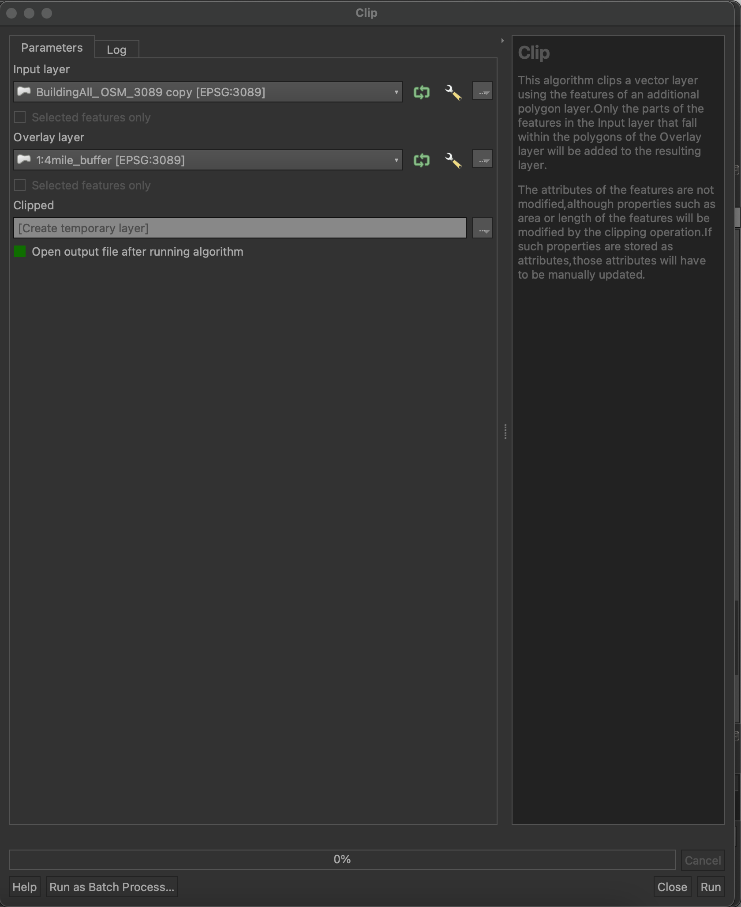

# Public transport accessibility in Lexington, KY

## Table of Contents

##

### Data acquisition

A quick examination of the [Open Street Map](https://wiki.openstreetmap.org/wiki/Main_Page) map feature documentation gives several possible options of acquiring data.
The most obvious one would be the key 'piblic transport' and all its values:

 * stop_position 
 * platform 
 * station 
 * stop_area. 

At this point we have a chance to realize that the most apparent one is not always the best one. Further exporation and comparison with other datasets shows that it contains only bus stops for just a few bus routes.  
Although it contains important attributes (such as reference number and names of bus stops), this layer won't be used in the project. 
Another key to check is 'amenity', as it contains the value 'bus station". Access this data and get the polygon of the central bus station in Lexington and points just around it, which is also not useful for this project. 
So, the main source of data is the key 'route'. Using Quick quiery in QuickOSM plugin, I accessed the value 'bus' and acquire all the data. I have not chosen any other values, because there is no other public transportation system in Lexington. 


*Quick Query in OSM*

The route dataset contains bus route lines and definitive information, such as the start and end point, reference number of the route, its name and operator (well, there is only one operator in Lexington). Open Street map is a very rich source of data, but to obtain more accuracy it is good to check the consistency of information. The assumption is that the official website of local operator is the most reliable source of information. So I open [Lextran website](https://lextran.com) and check manually each route and its configuration (the OSM data appeared to be very precise). 

Hovewer, there are several considerations about the data filtering. 
* Route 8 changes due to the exact day of the week. 
Monday-Friday the route expands to BlueGrass airport. OSM data contains the shorter version, and I have chosen not to edit it, because the focus of my project is on general accessibility, and the stactic map gives very little opportunities of representing different schedules. 


*Route 8, Monday-Friday, official Lextran website*

*Route 8, weekend, official Lextran website*

* Route 27 won't operate till August, 2022. For purposes of interactive constantly updating map I would definitely filter out this route, but for the purpose of the static map there is no need to exclude anything that is out of operation temporarily. 

* I did not edit the OSM data to reflect any of temporary detouring or any kind of tempopary changes in schedules listed on Lextran website. 

* There are 4 night routes in Lexington. All of them are excluded from the analysis. As the final map is supposed to be static, not interactive, the night buses, which have different routes from the 'normal' ones, will significantly distort the analysis. 

Thus, I save night buses as a separate geopackage. 
To filter all routes I use the following SQL expression:

```js
 "ref"='51' OR "ref"='52' OR "ref"='58'  OR  "ref"='59'  
``` 

Test shows 4 rows. I save it a separate geopackage in ESPG:3089 / Kentucky Single Zone projection.
The next is to filter all regular day buses: 

```js
  NOT ("ref"='51' OR "ref"='52' OR "ref"='58' OR "ref"='59' )
```
Test shows 37 rows (it is the right number - some routes consists of several lines). We save that as geopackage as well in ESPG:3089 / Kentucky Single Zone projection, because this is the prepared and filtered for the map data. 

Thus, the vector layer, that contains the bus routes is ready for analysis. But it is more appropriate to analyze the accessibility of public transport by buffering from the bus stops - people can only get to the bus at the bus stop, right?

So, according to Open Street Map documentation and quick examination of the attribute tables I have already acquired, there are three possible sources of bus stops points. It is highway, route_bus, amenity and public transport. Filter each point layer, get only bus stops in each one, and then use the Merge vector layer tool (**Vector > Data Management Tools**) to unite all the data(Route > bus_stop, Public transport > bus_station, Highway > bus_stop) in one layer for further analysis. Obtain something like this:



It is well-known fact, that public transportation in many American cities leaves much to be desired, but to establish the route without stops is not something one could imagine. The only option available was to georeference lacking data, so I did that with the help of Google Maps XYZ Tiles. After long and boring night get this:


Using Quick Query I also access buildings (all values) and highways (all values). I save it in ESPG:3089 / Kentucky Single Zone projection. 
Now all the vector data is ready for the analysis. 

### Analysis

To define the accessibility of public transportation is to find out how many places one can reach using the public transportation network. 
[U.S. Department of Transportation](https://highways.dot.gov) in its pedestrian safety guide mention that people are generally ready to walk longer distance for railway stations or for leasure facilities, while they are ready to tolerate much shorter distance to a bus stop. Although access to diverse and qualitative leisure options may significantly affect quality of life, it is reasonable to start with basic. So for the purpose of this analysis I chose 5 min walking distance, or 1/4 mile (1320 feet). 
I go to **Vector > Geoprocessing Tools > Buffer**. 



And get the result:


### Symbology 
Time to consider symbology. As I am considering accessibility, working with the output layer does not make a lot of sense. What really have to be shown is how many housing and facilities are located within those buffered zones. 
So, the main idea is to highlight those buildings (and here comes the 'building' layer obtained from OSM) which are within 1/4 mile distance and push back to the background those which are not. 
In order to do so, I duplicate building layer, and clip the copy with the buffered layer: 



The clipped copy I symbolize with brighter colors, and the original one with darker colors and lower opacity. 
Generally, the choice of colors and symbols is inspired by the night sky, thunderstorms and lightning. It also help to visually divide the city spaces on the basis of public transportation accessibility. 


Colors used for the map:
* background: #1a162b
* bus lines: #e8ff91
* builings within buffer zones: #4777e7 with the shapeburst fill to give it additional shine
* buildings outside buffer zones: #585b7d

The same colors I will be using for my web page to create a sense of consistency. 

### Layout

In the layout I used the saample colors for the title, map details, legend, the scale bar and the north arrow. Lexington's shape is hard to place neatly in most widely known page formats, so I chose to move all additional equipment to the left and zoom in the map itself. 
Also saved a template for additional maps. 

### References
U.S. Department of Transportation oficial website: https://highways.dot.gov
Pedestrian Safety Guide for Transit Agencies issued by U.S. Department of Transportation: https://safety.fhwa.dot.gov/ped_bike/ped_transit/ped_transguide/ch4.cfm
Daniels, R., & Mulley, C. (2013). Explaining walking distance to public transport: The dominance of public transport supply. Journal of Transport and Land Use, 6(2), 5–20. http://www.jstor.org/stable/26202654